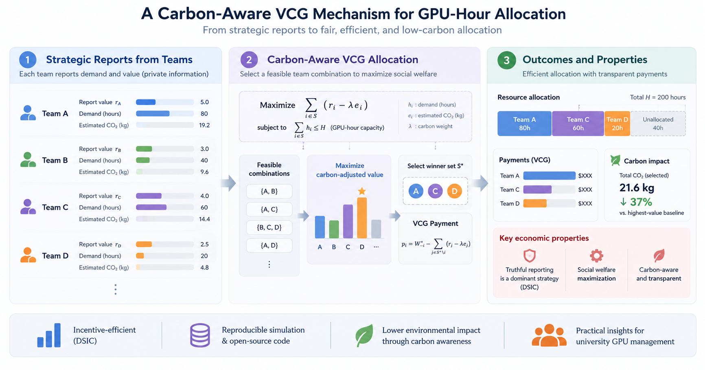

# Transparent GPU-Hour Allocation

[](https://huggingface.co/spaces/dku-comsci-econ206-2026/PS2_Team_A)
[](https://colab.research.google.com/drive/1uBTife193s0VDvmCZH3UQG1Q-UMNEcNx)

**COMPSCI/ECON 206, Team A (FP5)**
*Mustafa Ayub Khan · Temur Akhtamjonov · Gihun Lee*

> **Research question.** How should an organization allocate **100 shared GPU-hours** when project teams have private project values but observable GPU requests and estimated emissions, and can a published, carbon-aware allocation rule do better than first come, first served without inviting misreporting?



*Figure 1. Caption in [colab/figures/teaser_caption.md](colab/figures/teaser_caption.md). Regenerate with `python colab/scripts/make_teaser.py` (needs matplotlib).*

We compare two rules on the same six teams:

1. **Random-order FCFS (baseline):** teams arrive in a random order, and each full request is served while capacity remains. We compute all 720 orders exactly.
2. **Carbon-aware VCG priority mechanism:** teams simultaneously report a private project value. The rule selects the feasible group with the highest total of reported value minus a published carbon penalty, and each selected team pays its VCG externality in priority credits.

## Research artifacts

| Artifact | Link | What it shows |
|---|---|---|
| Verified release | [`ps2-review` tag](https://github.com/GihoonE/COMPSCI206-PS2/tree/ps2-review) | The exact code, notebook, and outputs reported below |
| Colab notebook | [Open in Colab](https://colab.research.google.com/drive/1uBTife193s0VDvmCZH3UQG1Q-UMNEcNx) | Self-contained model code, proof sketch, utility plots, checks, fresh-run record |
| Hugging Face Space | [PS2_Team_A](https://huggingface.co/spaces/dku-comsci-econ206-2026/PS2_Team_A) | Play one team: FCFS, then VCG with a prediction, allocation and payment audit, a *what-if* report slider, and reflection |

## Game design: a static game with incomplete information

- **Static:** every team submits one report at the same time and nobody sees the others' reports first. It is not an ascending (English) auction.
- **Incomplete information:** each team knows its own project value but not the other teams' values.

### Variables

- $i \in \lbrace A, B, C, D, E, F \rbrace$: a project team (player)
- $v_i$: true project value, **private** (baseline: 3, 6, or 9)
- $r_i$: reported value, the team's action (a strategy maps $v_i \mapsto r_i$)
- $d_i$: GPU-hours requested, **public**
- $e_i = 0.24\,d_i$: estimated emissions in kg CO₂e, **public**
- $\lambda = 0.5$: carbon penalty per kg CO₂e
- $s_i = r_i - \lambda e_i = r_i - 0.12\,d_i$: selection score
- $K = 100$: shared GPU-hours
- $S$: a group of teams, feasible if $\sum_{i \in S} d_i \le K$
- $S^*$: the feasible group with the largest $\sum_{i \in S} s_i$ (all $2^6 = 64$ groups are checked)
- $W^*_{-i}$: the best total score the other teams could reach if $i$ were absent
- $p_i = W^*_{-i} - \sum_{j \in S^* \setminus \lbrace i \rbrace} s_j$: VCG payment in score units (×10 = priority credits)
- $u_i = v_i - \lambda e_i - p_i$ if $i \in S^*$, otherwise $u_i = 0$: payoff

### Timing

1. Each team learns its own $v_i$.
2. All teams submit $r_i$ at the same time.
3. The rule selects $S^*$, allocates the full $d_i$ to each $i \in S^*$, and charges $p_i$.

Truthful reporting is optimal whatever the others report (DSIC), so teams need no beliefs about the other teams' values.

### Solution concept

| Format | Game class + solution | Equilibrium condition used | Benchmark strategy |
|---|---|---|---|
| Carbon-aware multi-team VCG | Static + incomplete; direct mechanism; **DSIC (therefore also BNE)** | $u_i(v_i, v_i, r_{-i}) \ge u_i(v_i, r_i, r_{-i})\ \ \forall r_i, r_{-i}$ | $r_i = v_i$ |

- **Utility.** A selected team bears its own announced carbon penalty: $u_i = v_i - \lambda e_i - p_i$ if selected, and 0 otherwise.
- **Payment.** $p_i = W^*_{-i} - \sum_{j \in S^* \setminus i}(r_j - \lambda e_j)$, where $W^*_{-i}$ is the best total score of the other teams without $i$.
- **Why truth is dominant (Groves argument).** Substituting the payment gives $u_i = \big[\text{total score of } S^* \text{ evaluated at } i\text{'s true value}\big] - W^*_{-i}$. The second term does not depend on $r_i$, and reporting $r_i = v_i$ makes the mechanism maximize exactly the first term. Therefore truth is optimal for every $r_{-i}$. The full sketch is in the notebook.
- **Why the carbon term matters.** If utility were $v_i - p_i$, the best report would be $r_i = v_i + \lambda e_i$, and DSIC would fail.
- **Special case.** With one item and $\lambda = 0$, the rule is the Vickrey second-price auction.

DSIC needs priority credits to carry a real future opportunity cost. The code checks the rule, not that condition.

## Parameters

| Symbol | Meaning | Value |
|---|---|---|
| $K$ | shared GPU-hours | 100 |
| $n$ | project teams | 6 |
| $d_i$ | GPU-hours requested (observable) | A, D: 25 · B, E: 20 · C, F: 15 |
| $v_i$ | true project value (private) | A, D: 9 · B, E: 6 · C, F: 3 (High / Medium / Low) |
| $r_i$ | reported value | $r_i = v_i$ in the baseline; varied 0–10 in the truthfulness check |
| $e_i$ | estimated emissions, kg CO₂e | $0.24\,d_i$ |
| $\lambda$ | carbon penalty per kg CO₂e | 0.5 (sensitivity: 0, 1) |
| — | priority credits per score unit | 10 |
| — | FCFS arrival orders | all 6! = 720, plus one illustrative order A→B→E→C→D→F |

## Algorithm (language-independent pseudocode)

```text
FCFS(order):
    remaining ← K
    for i in order:
        if d_i ≤ remaining: serve i; remaining ← remaining − d_i
Repeat FCFS for all 720 orders.

VCG(r):
    feasible ← all 64 groups S with Σ_{i∈S} d_i ≤ K
    S* ← argmax_{S ∈ feasible} Σ_{i∈S} (r_i − λe_i)      # ties: more teams, then earlier team
    for i in S*:
        W*_{−i} ← best feasible total without i
        p_i ← W*_{−i} − Σ_{j∈S*\i} (r_j − λe_j)          # in score units; ×10 = credits
    u_i ← v_i − λe_i − p_i if i ∈ S*, else 0

Truthfulness check:
    for each team i, for r_i in 0, 0.5, …, 10 (rivals fixed):
        run VCG; confirm that u_i(r_i) ≤ u_i(v_i)
```

## Results (actual output)

**Fixed example** (`colab/outputs/summary.csv`):

| Metric | FCFS (order A→B→E→C→D→F) | Carbon-aware VCG |
|---|---:|---:|
| Selected teams | A, B, E, C, F | A, B, D, E |
| Teams served | 5 | 4 |
| GPU-hours used / unused | 95 / 5 | 90 / 10 |
| Total true project value | 27 | 30 |
| Carbon-adjusted true score | 15.6 | 19.2 |
| Estimated emissions (kg CO₂e) | 22.8 | 21.6 |
| Priority-credit payments | 0 | 96 (24 per winner) |

**Random-order FCFS over all 720 orders** (`colab/outputs/fcfs_all_orders.csv`):

| Metric | FCFS mean | FCFS min–max | VCG |
|---|---:|---:|---:|
| Teams served | 4.93 | 4–5 | 4 |
| GPU-hours used | 97.0 | 90–100 | 90 |
| Total true project value | 28.6 | 27–30 | 30 |
| Carbon-adjusted true score | 16.96 | 15.6–19.2 | 19.2 |
| Estimated emissions (kg CO₂e) | 23.28 | 21.6–24.0 | 21.6 |

Under FCFS, each 25- or 20-hour team is served in 76.7% of orders, and each 15-hour team in 93.3%. No arrival order beats the VCG score. FCFS serves slightly more teams on average, but it uses more capacity and emits more.

**Utility and payments under VCG** (`colab/outputs/vcg_team_results.csv`): A and D each have utility 9 − 3 − 2.4 = 3.6. B and E each have 6 − 2.4 − 2.4 = 1.2. C and F are not selected, so their utility is 0.

**Truthfulness check** (`colab/outputs/truthfulness_check.csv`): for all six teams, no report in 0, 0.5, …, 10 gives higher utility than the true value.

**Carbon-penalty sensitivity** (demands, values, capacity, and algorithm fixed):

| $\lambda$ | Selected teams | GPU-hours | Emissions (kg CO₂e) |
|---:|---|---:|---:|
| 0.0 | A, B, C, D, F | 100 | 24.0 |
| 0.5 | A, B, D, E | 90 | 21.6 |
| 1.0 | A, B, D, E | 90 | 21.6 |

## Reproduce

The model, script, and tests need only the Python standard library (Python 3.9 or newer).

**Colab:** open the [shared notebook](https://colab.research.google.com/drive/1uBTife193s0VDvmCZH3UQG1Q-UMNEcNx) (a copy is in `colab/notebooks/01_gpu_hour_vcg_allocation.ipynb`), choose *Runtime → Run all*, and check that the last cell prints `PASS` for every check. The notebook is self-contained: the full model code is inside it, so it needs no clone and no installs.

**Local:**

```bash
git clone --branch ps2-review https://github.com/GihoonE/COMPSCI206-PS2.git
cd COMPSCI206-PS2/colab
python run_simulation.py                      # prints results, rewrites outputs/*.csv
git diff --exit-code outputs/                 # expected = actual: no diff means the committed outputs were reproduced
python -m unittest discover -s tests -v       # baseline, DSIC (fixed + 100 random games), 720-order FCFS, notebook = src
```

`matplotlib` is needed only for the notebook's utility plot (preinstalled on Colab) and `scripts/make_teaser.py`: `python -m pip install -r colab/requirements.txt`.

## Verification record

| Date | Environment | Command | Result |
|---|---|---|---|
| 2026-09-26 | Python 3.14.7, macOS (arm64) | `python colab/run_simulation.py` then `git diff --exit-code colab/outputs/` | outputs reproduced; all six truthfulness checks PASS |
| 2026-09-26 | Python 3.14.7, macOS (arm64) | `cd colab && python -m unittest discover -s tests -v` | 5 tests OK |
| 2026-09-26 | Jupyter `nbconvert --execute` in an empty folder (no repository), matplotlib 3.11 | notebook fresh run | 7 / 7 checks PASS, utility plot rendered (saved in the notebook) |
| _pending_ | Google Colab hosted runtime | *Run all* on the tagged notebook | _to be run and recorded by a team member_ |

## Repository structure

```text
README.md                          this file
colab/                             computational artifact (Colab simulation)
├── notebooks/01_gpu_hour_vcg_allocation.ipynb   self-contained notebook: model code, proof sketch, plots, fresh-run record
├── src/gpu_allocation.py          model, exact subset solver, FCFS, VCG payments, utility, truthfulness sweep, all-orders FCFS
├── run_simulation.py              runs everything and writes colab/outputs/
├── tests/test_gpu_allocation.py   automated checks, including that the notebook's model cells equal src/
├── outputs/                       summary.csv, fcfs_team_results.csv, vcg_team_results.csv,
│                                  fcfs_all_orders.csv, truthfulness_check.csv
├── figures/                       teaser.pdf / teaser.png and caption
├── scripts/make_teaser.py         draws Figure 1 from the model code
├── requirements.txt
└── AI_USE.md                      AI-assistance disclosure
```

## Evidence boundary and limitations

- **Computed, not observed.** Every number here comes from the formal model. The code checks the announced allocation and payment rule, but it cannot verify a team's true private value.
- **Behavioral evidence lives in the Hugging Face Space and is exploratory.** The Space's rival teams are simulated and truthful. Classroom play is a small, self-selected sample with hypothetical stakes, so it is not population-level causal evidence.
- **Assumptions.** The 0.24 kg CO₂e per GPU-hour rate and $\lambda = 0.5$ are announced classroom-model assumptions, not measured emissions for real workloads. Heterogeneous hardware, location, or time-specific emissions are out of scope.
- **DSIC condition.** Truthful reporting is dominant only if priority credits have a real future opportunity cost and teams internalize the announced carbon penalty.
- **Scale.** Exhaustive search (2ⁿ groups) is exact for six teams. Larger n would need an integer-programming solver.

## Attribution

Theory: Vickrey (1961), Clarke (1971), and Groves (1973) for the VCG mechanism. The course materials for COMPSCI/ECON 206 provide the solution-concept framing. AI assistance is disclosed in [colab/AI_USE.md](colab/AI_USE.md). Full references are in the proposal.
