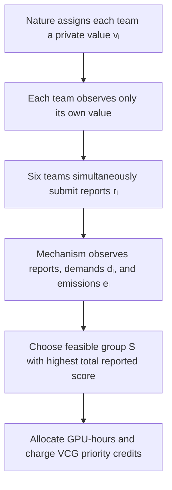

# Transparent GPU-Hour Allocation

**COMPSCI/ECON 206, Team A (FP5)**
*Mustafa Ayub Khan · Temur Akhtamjonov · Gihun Lee*

This project asks how an organization can allocate **100 shared GPU-hours** when project teams have private project values but observable GPU requests and estimated emissions. We compare:

1. **Random-order FCFS (baseline):** full requests are served in a fixed public arrival order while capacity remains.
2. **Carbon-aware VCG priority mechanism:** teams simultaneously report a private project value; the rule selects the feasible group with the highest total reported value minus a published carbon penalty. Selected teams pay VCG externality prices in priority credits.

## Start here

- **Runnable notebook:** [Open the verified Colab notebook](https://colab.research.google.com/github/GihoonE/COMPSCI206-PS2/blob/main/notebooks/01_gpu_hour_vcg_allocation.ipynb)
- **Local reproduction:** run `python run_simulation.py` from this repository.

No third-party Python packages are required. The notebook and local script use the same exact solver and fixed six-team example.

## Game design

This is a **static, simultaneous-move game with incomplete information**. Each team privately knows its project value \(v_i\) and submits a report \(r_i\) at the same time. GPU demand \(d_i\) and estimated emissions \(e_i\) are observable.

The VCG rule is a direct mechanism, not a sequential auction. Its solution benchmark is **dominant-strategy incentive compatibility (DSIC)**: truthful reporting is optimal for each team regardless of the other teams' reports, provided priority credits have a meaningful future opportunity cost. DSIC is stronger than Bayesian Nash equilibrium, so truthful reporting is also a Bayesian Nash equilibrium.



## Model and exact algorithm

For team *i*:

- GPU request \(d_i\) is observable.
- Value report \(r_i\) is private.
- Estimated emissions are \(e_i = 0.24d_i\) kg CO₂e.
- Baseline carbon penalty is \(\lambda=0.5\).
- Selection score is \(r_i - \lambda e_i = r_i - 0.12d_i\).

The solver enumerates every one of the \(2^6=64\) possible groups, removes groups whose total demand exceeds 100 GPU-hours, and selects the feasible group with the highest total reported score. Multiple teams can receive their full requests.

For each selected team, the program removes that team, solves the allocation again, and charges the VCG externality that the team imposes on the other teams. Payments are reported in score units and converted to priority credits at **10 credits per score unit**.

## Verified baseline result

The committed notebook was run successfully on September 25. The fixed example produces:

| Metric | FCFS | Carbon-aware VCG |
|---|---:|---:|
| Selected teams | A, B, E, C, F | A, B, D, E |
| Teams served (access breadth) | 5 | 4 |
| GPU-hours used | 95 | 90 |
| Unused GPU-hours | 5 | 10 |
| Total true project value | 27 | 30 |
| Carbon-adjusted true score | 15.6 | 19.2 |
| Estimated emissions (kg CO₂e) | 22.8 | 21.6 |
| Total priority-credit payment | 0 | 96 |

The carbon-penalty sensitivity check keeps demands, values, capacity, and the allocation algorithm fixed:

| Carbon penalty \(\lambda\) | Selected teams | GPU-hours | Emissions (kg CO₂e) |
|---:|---|---:|---:|
| 0.0 | A, B, C, D, F | 100 | 24.0 |
| 0.5 | A, B, D, E | 90 | 21.6 |
| 1.0 | A, B, D, E | 90 | 21.6 |

## Reproduce the results

```bash
python run_simulation.py
```

This writes the allocation audit to `outputs/`:

- `summary.csv` — comparison-level metrics.
- `fcfs_team_results.csv` — one row per team under FCFS.
- `vcg_team_results.csv` — one row per team under VCG, including allocation, payment, and utility.

The model uses fixed inputs and a fixed FCFS arrival order, so no random seed is needed for the committed baseline.

## Repository structure

- `src/gpu_allocation.py` — model, exact subset solver, FCFS baseline, and VCG payments.
- `run_simulation.py` — runs the fixed example and writes the CSV audit tables.
- `notebooks/01_gpu_hour_vcg_allocation.ipynb` — explanation, pseudocode, computation, sensitivity check, and fresh-run verification.
- `outputs/` — committed allocation-audit CSV files.
- `requirements.txt` — dependency record (the project uses only the Python standard library).

## Evidence boundary and limitations

The code verifies the announced allocation and payment rule, but it cannot verify a team's true private project value. The truthful-reporting benchmark applies only when priority credits have a meaningful future opportunity cost.

The 0.24 kg CO₂e per GPU-hour rate and \(\lambda=0.5\) carbon-penalty weight are **announced classroom-model assumptions**, not measured emissions for every real H100 workload. The sensitivity table tests the penalty weight; heterogeneous hardware, location, or time-specific emissions are outside the current scope.

## Attribution

Before final submission, this repository will add complete citations for Vickrey/VCG theory, course tools, the emissions assumption, reused code, and AI assistance.
